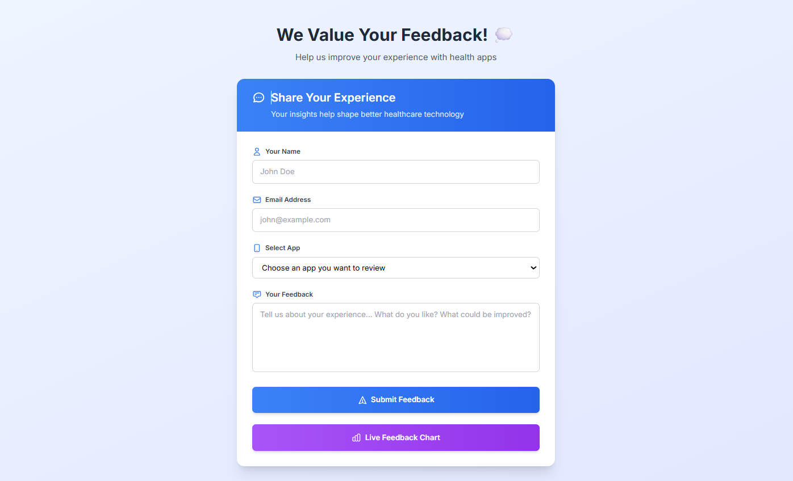
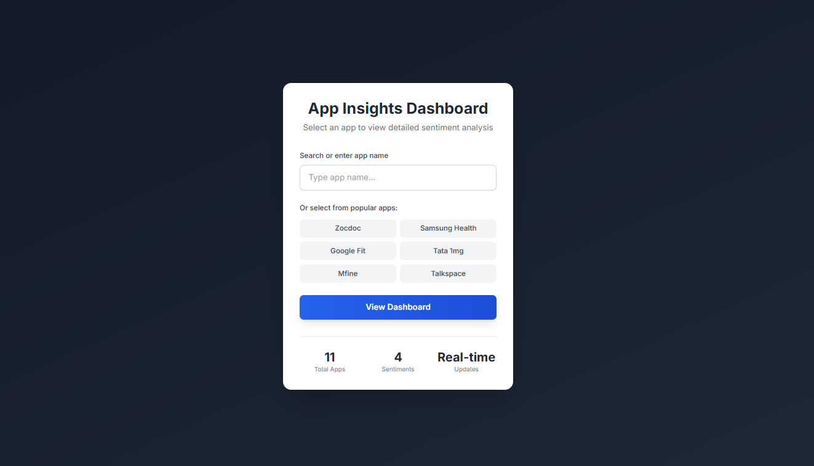
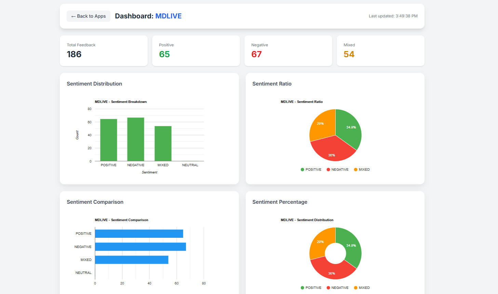
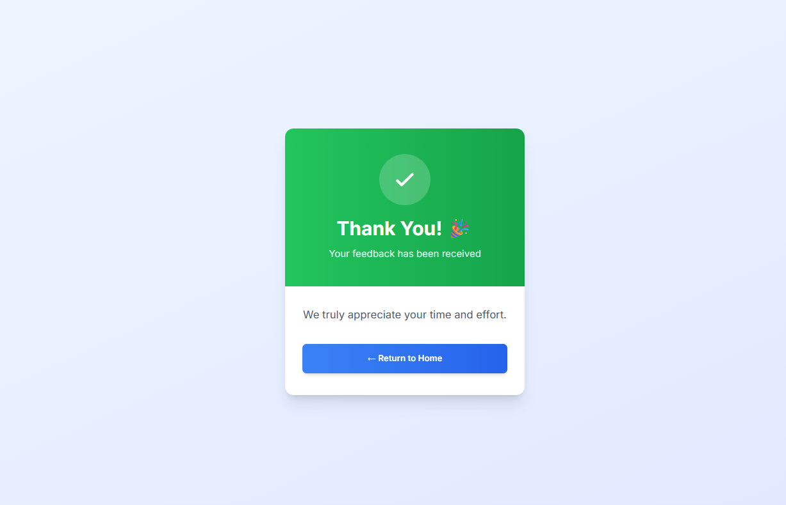

# 📊 Health App Feedback & Sentiment Analysis Dashboard

A real-time feedback collection system for health applications with AI-powered sentiment analysis and interactive visualizations.

<p align="center">
  <a href="https://qqainv8x5m.execute-api.ap-south-1.amazonaws.com/dev/">
    
  </a>
</p>

---

## 🎯 **Project Overview**

A fully serverless web application that collects user feedback for health applications, performs real-time sentiment analysis using AWS AI services, and displays interactive visualizations through a dynamic dashboard.

---
## 🖼️ **Screenshots**

### 📝 User Feedback Interface
*Clean, modern form for collecting user feedback*



### 📱 App Selection Page
*Select specific health apps for detailed analysis*



### 📊 Real-Time Dashboard
*Interactive charts showing sentiment distribution*



### ✅ Thank You Response
*Confirmation page after feedback submission*


---

## 🚀 **Live Demo**

Experience the application in action:

👉 **[Launch Live Application](https://qqainv8x5m.execute-api.ap-south-1.amazonaws.com/dev/)**

| Step | Action |
|------|--------|
| 1️⃣ | Submit feedback for any health app |
| 2️⃣ | Click "Live Feedback Chart" button |
| 3️⃣ | Select an app from the list |
| 4️⃣ | Watch real-time sentiment visualizations |

---

## ✨ **Key Features**

### 📝 **Feedback Collection**
- User-friendly form with app selection dropdown
- Support for **12+ health applications**
- Email validation and required field checks
- Real-time submission processing

### 🤖 **AI Sentiment Analysis**
- **AWS Comprehend** analyzes feedback text
- Detects: `POSITIVE`, `NEGATIVE`, `MIXED`, `NEUTRAL`
- Instant processing upon form submission
- 95%+ accuracy in sentiment detection

### 📈 **Interactive Dashboard**
| Chart Type | Purpose |
|------------|---------|
| 📊 **Stacked Bar Chart** | Sentiment distribution by app |
| 🥧 **Pie Chart** | Overall sentiment ratio |
| 📋 **Grouped Bar Chart** | Side-by-side sentiment comparison |
| 🍩 **Donut Chart** | Sentiment percentage visualization |

### 🎨 **Modern UI/UX**
- Gradient backgrounds and smooth animations
- Mobile-responsive design
- Real-time updates every 5 seconds
- Professional typography with Inter font

---

## 🏗️ **Architecture**
┌─────────────────┐ ┌──────────────┐ ┌─────────────────┐
│ Contact Form │────▶│ API │────▶│ Lambda │
│ (HTML/CSS) │ │ Gateway │ │ Function │
└─────────────────┘ └──────────────┘ └────────┬────────┘
│
┌───────────────────┼───────────────────┐
▼ ▼ ▼
┌───────────────┐ ┌───────────────┐ ┌───────────────┐
│ Comprehend │ │ DynamoDB │ │ AppSync │
│(Sentiment AI) │ │ Database │ │ GraphQL API │
└───────────────┘ └───────────────┘ └───────┬───────┘
│
┌──────────────────────────────────────┘
▼
┌───────────────┐
│ Dashboard │
│ (success.html)│
└───────────────┘


## 🛠️ Technology Stack

### Frontend
| Technology | Purpose |
|------------|---------|
| HTML5/CSS3 | Structure and styling |
| JavaScript | Client-side logic |
| Tailwind CSS | UI framework |
| Google Charts | Data visualization |
| Inter Font | Typography |

### Backend (AWS Serverless)
| Service | Purpose |
|---------|---------|
| API Gateway | REST API endpoints |
| Lambda | Business logic (Python 3.9) |
| DynamoDB | NoSQL database |
| AppSync | GraphQL API for real-time data |
| Comprehend | AI sentiment analysis |
| S3 | Static file hosting |

---

## 📁 Project Structure
📦 health-app-feedback
├── 📄 lambda_function.py # Main Lambda function (Python)
├── 📄 contactus.html # Feedback submission form
├── 📄 app_selection.html # App selector page
├── 📄 success.html # Dashboard with charts
├── 📄 lasting.html # Thank you page
└── 📄 README.md # Project documentation

---

## 🔄 Data Flow

### User Submits Feedback
User fills form → API Gateway POST → Lambda

Lambda calls Comprehend for sentiment analysis

Data stored in DynamoDB

User redirected to thank you page


### Dashboard Displays Data
User selects app → Dashboard loads

Dashboard calls AppSync directly every 5 seconds

AppSync queries DynamoDB for latest data

Google Charts render visualizations

KPI cards update in real-time

---

## 🚀 Deployment Guide

### Prerequisites
- AWS Account
- AWS CLI configured (optional)
- Python 3.9+ for local testing

### AWS Services Setup

#### 1. DynamoDB Table
| Property | Value |
|----------|-------|
| Table Name | `pranaybuklist3` |
| Primary Key | `email` (String) |

#### 2. AppSync API
| Property | Value |
|----------|-------|
| API Name | "My AppSync API" |
| Authentication | API Key |
| Schema | Includes `getSentiments` query |
| Data Source | DynamoDB table |

#### 3. Lambda Function
| Property | Value |
|----------|-------|
| Runtime | Python 3.9 |
| Handler | `lambda_function.lambda_handler` |
| Permissions | DynamoDB, Comprehend, AppSync |

#### 4. API Gateway
| Resource | Method | Purpose |
|----------|--------|---------|
| `/dev/` | GET | Serve contact form |
| `/dev/?page=app_selection` | GET | Serve app selector |
| `/dev/dashboard` | GET | Serve dashboard page |
| `/dev/` | POST | Submit feedback |

### Deployment Steps

```bash
# 1. Clone the repository
git clone https://github.com/yourusername/health-app-feedback.git
cd health-app-feedback

# 2. Zip Lambda deployment package
zip -r deployment.zip lambda_function.py *.html

# 3. Upload to AWS Lambda
aws lambda update-function-code \
  --function-name pranaydemofunction \
  --zip-file fileb://deployment.zip

# 4. Deploy API Gateway changes (via AWS Console)
🌐 API Endpoints
Endpoint	Method	Purpose	Response
/dev/	GET	Serve feedback form	HTML
/dev/?page=app_selection	GET	Serve app selector	HTML
/dev/dashboard?app={name}	GET	Serve dashboard	HTML
/dev/	POST	Submit feedback	Redirect
🎯 Supported Apps
#	App Name	Category
1	Samsung Health	Fitness
2	LG Health	Fitness
3	Huawei Health	Fitness
4	Google Fit	Fitness
5	Mi Fit	Fitness
6	Teladoc Health	Telemedicine
7	MDLIVE	Telemedicine
8	Talkspace	Mental Health
9	Zocdoc	Doctor Booking
10	Mfine	Healthcare
11	Tata 1mg	Pharmacy
12	GOOD MED	Healthcare
📊 Dashboard Components
KPI Cards
Total Feedback - Overall count

Positive - Green card

Negative - Red card

Mixed - Yellow card

Charts
Chart Type	What It Shows
Stacked Bar	Sentiment distribution by app
Pie Chart	Overall sentiment ratio
Grouped Bar	Sentiment comparison
Donut Chart	Sentiment percentage
🔒 Security Features
✅ API Gateway as secure entry point

✅ AppSync API Key authentication

✅ Lambda IAM roles with least privilege

✅ CORS enabled for browser access

✅ Input validation on form submissions

🧪 Testing
Local Testing
bash
# Test HTML files locally
open contactus.html  # or double-click in file explorer
API Testing
bash
# Test AppSync query
curl -X POST https://your-appsync-url/graphql \
  -H "x-api-key: your-api-key" \
  -d '{"query":"query { getSentiments { appName sentiment } }"}'
🎨 Customization Guide
Add New Apps
Edit the dropdown in contactus.html and app_selection.html:

html
<option value="New App">New App</option>
Modify Chart Colors
In success.html, update the colors array:

javascript
colors: ['#4CAF50', '#F44336', '#FF9800', '#9E9E9E']
Change Update Interval
javascript
setInterval(fetchSentiments, 5000); // Change to desired ms
🐛 Troubleshooting
Issue	Solution
403 errors on dashboard	Check AppSync API key validity
No data in charts	Verify DynamoDB has records for selected app
Form submission fails	Check Lambda CloudWatch logs
CORS errors	Ensure API Gateway has CORS enabled
Charts not loading	Verify Google Charts script is loading
🚀 Future Enhancements
Cognito authentication for secure dashboard access

Email notifications for critical feedback

Export data to CSV/Excel

Date range filtering on dashboard

Word cloud visualization of common terms

Multi-language support

Mobile app integration

PDF report generation

📝 License
This project is licensed under the MIT License - see the LICENSE file for details.

👏 Acknowledgments
AWS for serverless services

Google Charts for visualization library

Tailwind CSS for styling framework

All contributors who helped test and improve

📞 Contact
For questions or support:

GitHub Issues: Open an issue in this repository

Email: chalumuripranaykumar@gmail.com

Built with ❤️ using AWS Serverless Technologies

Thank You
---

